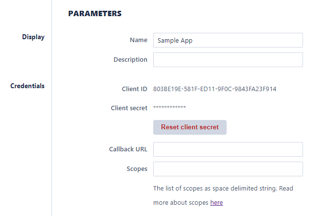

# OAuth Scopes

### List of available scopes

| Name | Description |
| ------------- | ------------- |
| `user` | Read/write access to users. |
| `user_read` | Readonly access to users. |
| `usergroup` | Read/write access to user groups. |
| `usergroup_read` | Readonly access to user groups. |
| `permissions` | Read/write access to resource permissions. |
| `permissions_read` | Readonly access to resource permissions. |
| `process` | Read/write access to processes. |
| `process_execute` | Execute access to processes. |
| `process_read` | Readonly access to processes. |
| `file` | Read/write access to files, including upload and changing the metadata. |
| `file_read` | Readonly access to files, including download. |
| `mtable` | Read/write access to managed tables. |
| `mtable_read` | Readonly access to managed tables. |

### How to set up scopes for the application

On solvexia web application, go to Solvexia API. 

In Application, user can add the preferred scopes using whitespace-separated list.

### Default scopes for OAuth applications

If the scopes are not set up for the application and the scopes are not set during the access token request, the default scope will be process_read
